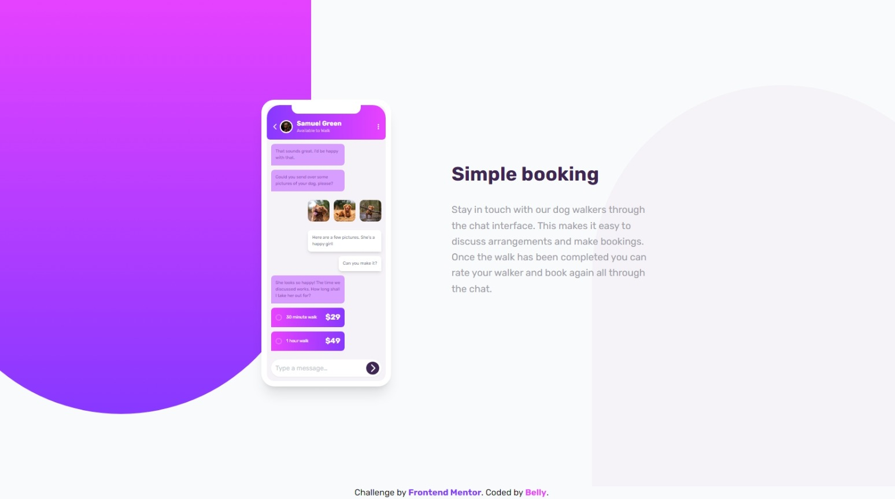
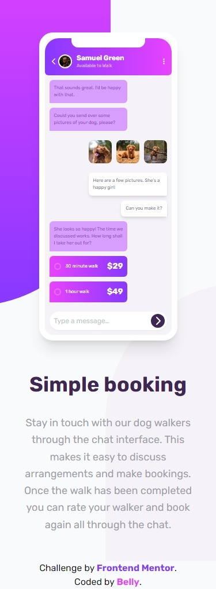

# Frontend Mentor - Chat app CSS illustration solution

This is a solution to the [Social links profile challenge on Frontend Mentor](https://www.frontendmentor.io/challenges/social-links-profile-UG32l9m6dQ). Frontend Mentor challenges help you improve your coding skills by building realistic projects.

## Table of contents

- [Overview](#overview)
  - [The challenge](#the-challenge)
  - [Screenshot](#screenshot)
  - [Links](#links)
- [My process](#my-process)
	- [Built with](#built-with)
	- [What I learned](#what-i-learned)
  - [Useful resources](#useful-resources)
- [Author](#author)

**Note: Delete this note and update the table of contents based on what sections you keep.**

## Overview

### The challenge

Users should be able to:

Your challenge is to build out this feature illustration using HTML & CSS and get it looking as close to the design as possible.

The only assets we provide in this challenge are the image of the person in the app UI and the 3 images of the dog. You need to create everything else using HTML & CSS!

Your users should be able to:

- View the optimal layout for the component depending on their device's screen size
- **Bonus**: See the chat interface animate on the initial load

### Screenshot




### Links

- Solution URL: [[solution URL here]([https://github.com/Belly606/Huddle-landing-page-with-curved-sections/](https://github.com/Belly606/Chat-app-CSS-illustration))]
- Live Site URL: [[live site URL here]([https://belly606.github.io/Huddle-landing-page-with-curved-sections/](https://belly606.github.io/Chat-app-CSS-illustration/))]

## My process

### Built with

- Semantic HTML5 markup
- CSS custom properties
- Flexbox
- CSS Grid
- Mobile-first workflow
- [Tailwind](https://tailwindcss.com/) - CSS Framework

### What I learned

Use this section to recap over some of your major learnings while working through this project. Writing these out and providing code samples of areas you want to highlight is a great way to reinforce your own knowledge.

```js
/** @type {import('tailwindcss').Config} */
module.exports = {
  content: ["./*.html"],
  theme: {
    extend: {
      fontFamily: {
        "Rubik": ["Rubik", "sans-serif"]
      },
      fontSize: {
        '2xs': ".5rem"
      },
      colors: {
        "Pale-Violet": "hsl(276, 100%, 81%)",
        "Moderate-Violet": "hsl(276, 55%, 52%)",
        "Desaturated-Dark-Violet": "hsl(271, 15%, 43%)",
        "Grayish-Blue": "hsl(206, 6%, 79%)",
        "Very-Dark-Desaturated-Violet": "hsl(271, 36%, 24%)",
        "Dark-Grayish-Violet": "hsl(270, 7%, 64%)",
        "Light-Magenta": "hsl(293, 100%, 63%)",
        "Light-Violet": "hsl(264, 100%, 61%)",
        "Light-Grayish-Violet": "hsl(270, 20%, 96%)",
        "Very-Light-Magenta": "hsl(289, 100%, 72%)",
      },
      borderWidth: {
        "10": "10px"
      },
      height: {
        "172": "43rem",
        "200": "50rem",
      },
      width: {
        "120": "30rem",
        "176": "44rem",
      },
    },
  },
  plugins: [],
}
```

### Useful resources

- [Elzero HTML Course](https://elzero.org/study/html-2021-study-plan/) - This helped me for Understanding HTML & Make it a piece of Cake for me. I really appreciate he instructor so much.
- [Elzero CSS Course](https://elzero.org/study/css-2021-study-plan/) - This helped me for Understanding CSS & Make it a piece of Cake for me. I really appreciate he instructor so much.
- [Tailwind CSS Course](https://www.youtube.com/playlist?list=PLnD96kXp-_pMR9cBUmvsz_kIIt9bv2UIP) - This is an amazing course which helped me finally understand How Tailwind CSS Works. I'd recommend it to anyone still learning this concept.

## Author

- Github - [Belly](https://github.com/Belly606)
- Frontend Mentor - [@Belly606](https://www.frontendmentor.io/profile/Belly606)
